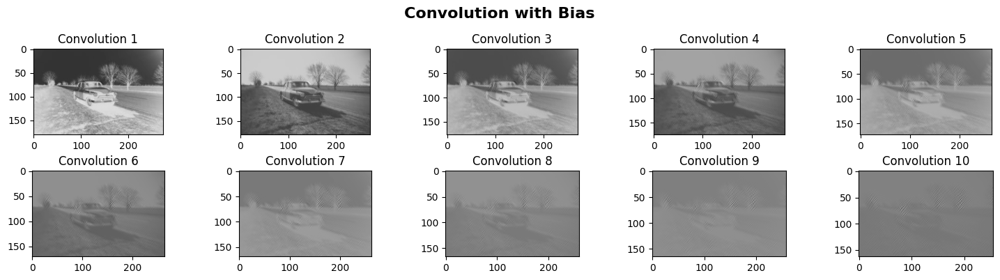

# Computer Vision Projects

This repository showcases a collection of Computer Vision projects, from classic image classification to more advanced deep learning applications.
Each project is designed to solve a real-world problem, highlighting skills in:

* Image preprocessing (resizing, normalization, augmentation)
* Deep learning modeling with Convolutional Neural Networks (CNNs)
* Overfitting prevention techniques (Dropout, Data Augmentation, Regularization)
* Model evaluation and hyperparameter tuning

| Project                    | Goal                                                | Key Techniques                                                 | Dataset                  | 
| -------------------------- | --------------------------------------------------- | -------------------------------------------------------------- | ------------------------ | 
| **Cat vs Dog Recognition** | Classify images of cats and dogs                    | CNN, Data Augmentation, Class Balancing, Hyperparameter Tuning | Kaggle Cats & Dogs       | 
| **Emotion Recognition**    | Detect facial emotions (happy, sad, surprise, etc.) | CNN, MaxPooling, Dropout, Image Resizing                       | FER2013 / Custom Dataset | 
| **SignMNIST**              | Recognize ASL letters from hand gesture images      | CNN, Feature Extraction                                        | Sign Language MNIST      | 

### Cat vs Dog Recognition

**Objective:** Train a CNN to classify images of cats and dogs with high accuracy, even on unseen data.

Highlights:

* Used data augmentation (rotation, flip, zoom) to boost generalization.
* Implemented strategies to handle imbalanced classes.
* Tuned learning rate, batch size, and architecture for better accuracy.

  ### Emotion Recognition

**Objective:** Detect emotions from facial images for applications in human-computer interaction and social robotics.

Highlights:

* MaxPooling layers for feature extraction.
* Dropout to reduce overfitting.
* Standardized image sizes to improve model robustness.
* Achieved high accuracy across multiple emotion categories.

### SignMNIST – ASL Letter Recognition

**Objective:** Recognize American Sign Language letters from images of hand gestures.

Highlights:

* Trained CNN on Sign Language MNIST dataset (excluding J & Z).
* Potential use cases in assistive technology for deaf/mute communication.
* Showcased strong feature extraction from low-resolution grayscale images.

### Tech Stack

* Languages: Python
* Libraries: TensorFlow/Keras, NumPy, Pandas
* Visualization: Matplotlib, Seaborn
* Image Processing: OpenCV, Pillow
